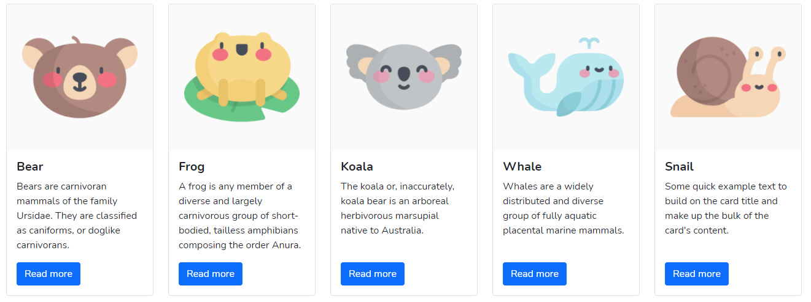

## 🎯 Objectifs

Le but de cet exercice est d'afficher une liste d'animaux sur une page web en utilisant les bonnes pratiques du framework Laravel.

L'objectif principal étant d'évaluer vos capacités à utiliser les différents langages suivants : 

- PHP
- JS
- HTML
- CSS

Les instructions ci-dessous correspondent à une base d'objectifs, vous pouvez en faire d'autres si vous avez des idées.

N'hésitez pas à ajouter des fonctionnalités sur la page qui affiche les animaux ou à créer d'autres pages.

Il n'y a aucune limitation sur les librairies que vous pouvez importer.
Vous pouvez également vous aider d'internet à tout moment.

## 📝 Instructions
- Clonez ce repository git sur votre ordinateur
- Lancez la commande `composer install` pour installer les dépendances
- Exécutez la commande `php artisan serve` pour lancer un serveur web qui écoute sur [http://127.0.0.1:8000](http://127.0.0.1:8000)
- Créez un controller `AnimalController` contenant une méthode `getAnimals()` qui permettra d'afficher les données de vos animaux (name, photo, description, link...)
- Créez un template blade `animals.blade.php`
- Créez une route `/animals` qui redirige vers ce template
- Passez les données des animaux au template via le controller
- Affichez les données dans des `cards` avec [Bootstrap](https://getbootstrap.com/docs/5.0/components/card/).

### Facultatif
- Triez les animaux par ordre alphabétique
- Rangez les animaux par catégories

### Astuces
- Les images de tous les animaux se trouvent dans le dossier `public/img/`. Pour afficher une image contenue dans ce répertoire, vous pouvez vous aider du [helper Laravel `asset()`]((https://laravel.com/docs/8.x/helpers#method-asset)).
- N'hésitez pas à utiliser les fonctions [`dump()`](https://laravel.com/docs/8.x/helpers#method-dump) et [`dd()`](https://laravel.com/docs/8.x/helpers#method-dd) pour débuguer.

## Exemple de résultat

## 📕 Liens utiles
- [Documentation de Laravel](https://laravel.com/docs/8.x)
- [Documentation de Bootstrap](https://getbootstrap.com/docs/5.0/getting-started/introduction/)
